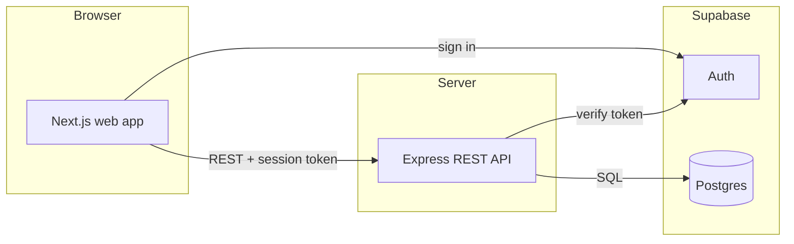
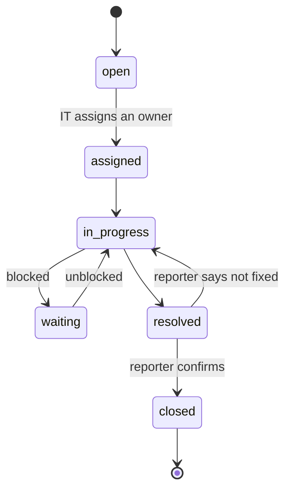

# Architecture

1. The user signs in through Supabase Auth and the web app receives a session token.
2. The web app calls the API with that token.
3. The API verifies the token, loads the user's role from `profiles`, and applies role and ownership rules.
4. The API reads and writes Postgres. Changes to a ticket and its activity trail happen in one transaction.

## Layout

| Path                  | Holds                                                                     |
| --------------------- | ------------------------------------------------------------------------- |
| `apps/web`            | Next.js frontend (not built yet)                                          |
| `apps/server`         | Express API: `features/<name>/router.ts` for routes, `logic.ts` for rules |
| `packages/shared`     | Validation schemas and vocabulary used by both apps                       |
| `supabase/migrations` | Database schema                                                           |
| `docs/decisions`      | Why each major choice was made                                            |

## Ticket lifecycle

